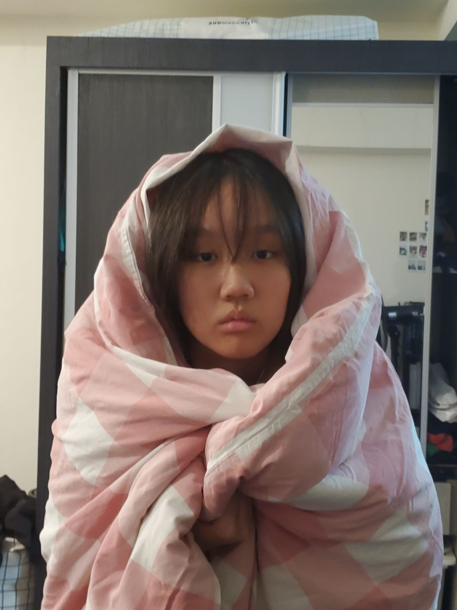
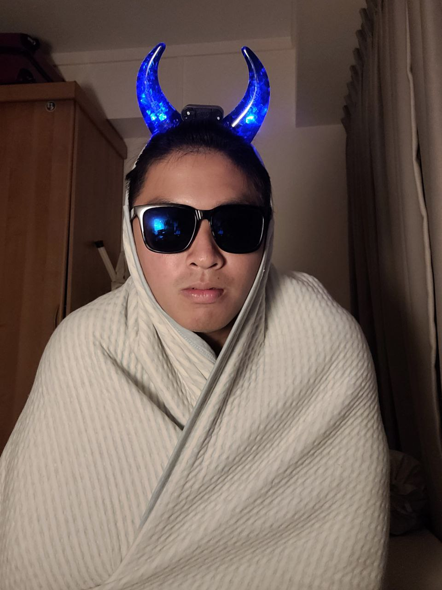

# :ghost: BOOlean

We are a team based in the [School of Computing, National University of Singapore](http://www.comp.nus.edu.sg), making a project for [Hack & Roll 2024](https://hacknroll.nushackers.org/)

Our team consists of:  
### Hue Koh [[github](https://github.com/huekoh)]

### Kaiyu [[github](https://github.com/kkaiyu)]

### Martin Ng [[github](https://github.com/martinng01)]

### Phinehas Tan [[github](https://github.com/phiphi-tan)]

